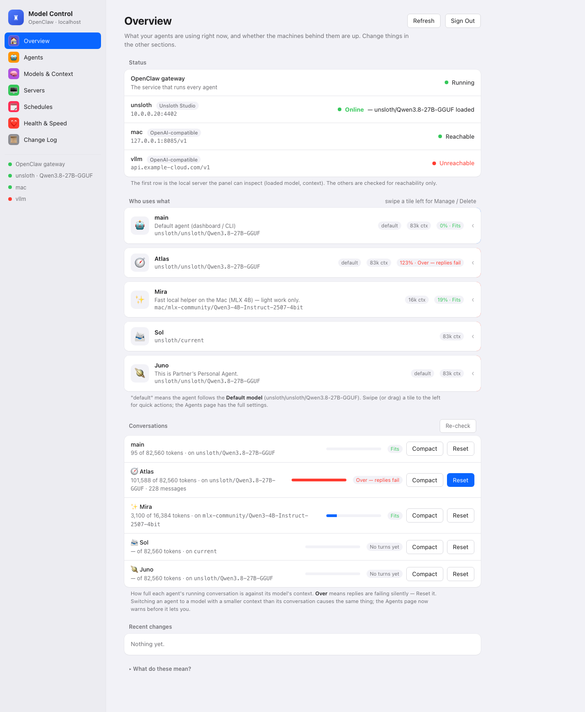
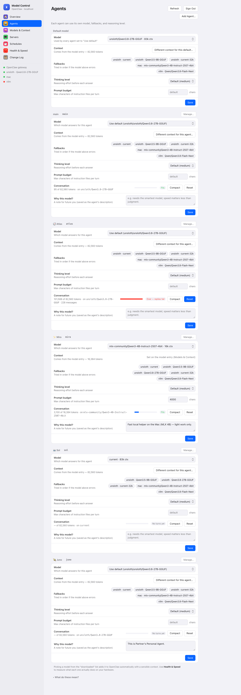
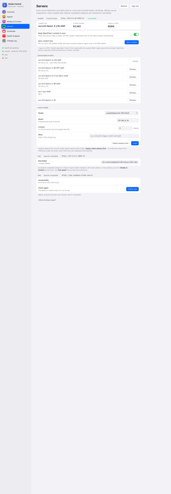
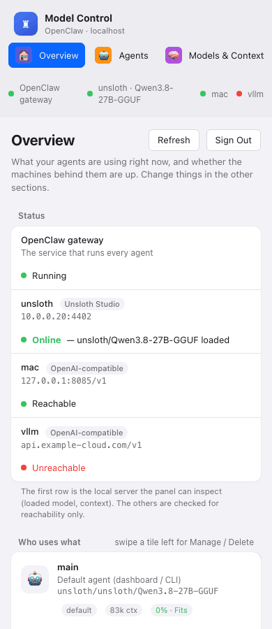
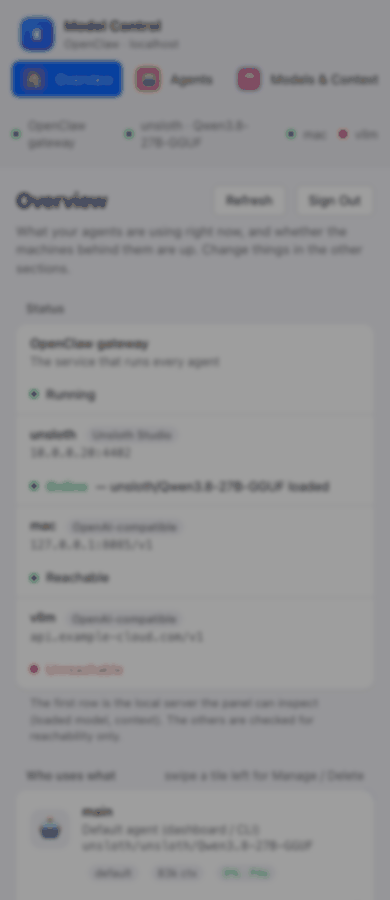
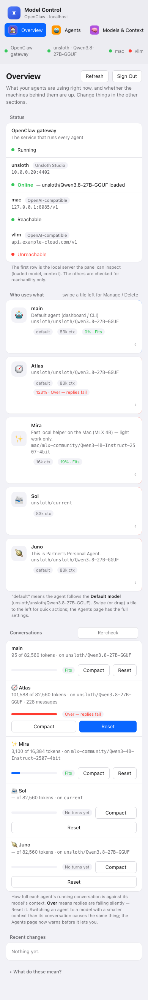

# clawdial — Model Control for OpenClaw

A small control panel for the models behind your [OpenClaw](https://openclaw.ai) agents. Which agent uses which model, how much context each one gets, what's actually loaded on your GPU box, and a few guard rails so the whole thing doesn't quietly fall over at 2am.

Single Python file, single HTML file, no dependencies. Looks like System Settings because that's what I kept wishing it looked like.



## Why this exists

I run OpenClaw on a Mac with a couple of agents, and the models live on a Windows box with an Intel Arc card running Unsloth Studio. For a while, "changing the model" meant editing `openclaw.json` by hand, restarting things, and forgetting which agent I'd pointed where.

Then one morning my main agent just stopped answering. No error on the phone, nothing obviously wrong. The gateway log eventually told the story: I'd loaded a bigger model on the GPU, its OpenClaw entry had a *smaller* context number than the conversation that agent was already carrying, and every single turn was overflowing before the model even started. Even the automatic compaction overflowed. Silent, total, and entirely my own fault.

So this panel does three things I'd been doing badly by hand:

1. **Shows the whole picture** — agents → models → servers, in one place, with the numbers that matter.
2. **Keeps context honest** — it reads what the server *actually* loaded and keeps OpenClaw's entries in step, and it shows how full each agent's conversation is before it tips over.
3. **Makes changes safe** — switching an agent to a model that can't hold its conversation warns you and offers to reset; deleting anything requires typing its name.

## What it does

**Overview** — status of the gateway and every model server; a tile per agent you can swipe left for *Manage* (a quick-edit modal) or *Delete*; how full each conversation is (Fits / Near limit / Over), with Reset and Compact buttons.

**Agents** — per agent: model, fallbacks, thinking level, prompt budget, tool access, a note on *why* this model. Create agents, rename them, change their tool profile, delete them (with a backup zip first). If you pick a model whose context is smaller than the agent's current conversation, it stops you.

**Models & Context** — every provider and model OpenClaw knows about. Edit context and max output, add/remove models, add a provider (API keys go into OpenClaw's `.env`, never into the config or the UI), test whether a server answers and what models it offers, run a quick speed test.

**Servers** — for each provider: what kind of server it is and whether it's up. Local servers get the full treatment: loaded model, loaded context, downloaded models, and (Unsloth) load a model with a memory check first. A one-click **Sync context** sets your OpenClaw entries to whatever the server loaded.

**Schedules** — "big model overnight, small one by day" style rules, with a reason field so future-you knows why.

**Health & Speed** — is everything up; time-to-first-word and tok/s per model.

**Change Log** — every change the panel made, including the automatic ones, so you can see what happened while you weren't looking.

Every page has a "What do these mean?" section at the bottom explaining context, fallbacks, thinking levels, quants and so on in plain words.

<p>


</p>
<p>



</p>

## Which model servers work

The panel talks to whatever OpenClaw's providers point at and works out what it's dealing with:

| Server | Detected how | What you get |
|---|---|---|
| **Unsloth Studio** | `/v1/status` answers | Loaded model + context, downloaded list, load with memory check, context sync, "context copies" (Unsloth serves any model name, so `current-32k` is just a smaller-context alias) |
| **LM Studio** | `/api/v0/models` answers | Loaded model + loaded context, downloaded list, context sync. Loading stays in LM Studio itself. |
| **Ollama** | `/api/tags` answers | Downloaded list, what's running and (where reported) its context. Loading stays in Ollama. |
| **Anything OpenAI-compatible** (vLLM, llama.cpp server, OpenAI, Anthropic-style proxies, RunPod…) | fallback | Reachability, model list, speed test, context/max-output editing. No "loaded model" concept, so those rows don't appear. |

Honesty note: Unsloth Studio and plain OpenAI-compatible endpoints are what I run, so those are tested against real servers. LM Studio and Ollama are coded against their documented APIs but I haven't had a live install to point at — if something's off, an issue with your `/api/v0/models` or `/api/ps` output would be very welcome.

## Install

Requirements: Python 3.9+, the `openclaw` CLI on the same machine as the gateway, a modern browser. That's it — the server is standard library only.

```bash
git clone https://github.com/Ninjafood/clawdial.git
cd clawdial
cp config.example.json config.json      # optional; defaults are fine for a normal OpenClaw install
python3 -I server.py --set-password     # pick a login password
python3 -I server.py                    # http://localhost:8790
```

On macOS, to have it start at login and restart if it dies:

```bash
scripts/install-macos.sh
```

(That writes a LaunchAgent pointing at the clone; delete it with `launchctl bootout gui/$(id -u)/ai.clawdial.model-control`.)

Elsewhere, run it under systemd, a tmux session, whatever you like — it's one process with no state outside its own folder.

### Config

`config.json` (all optional):

```json
{
  "port": 8790,
  "openclaw_bin": "openclaw",
  "openclaw_home": "~/.openclaw",
  "allowed_cidrs": ["127.0.0.0/8", "::1/128", "10.0.0.0/8", "172.16.0.0/12", "192.168.0.0/16", "100.64.0.0/10"],
  "backend_hint": { "myprovider": "lmstudio" }
}
```

`backend_hint` overrides auto-detection if it guesses wrong. `watch_logins` lists macOS accounts that must stay logged in (a dedicated iMessage user, say) — the panel shows a red row when one isn't. `gateway_restart_cmd` is what the Restart button runs if you don't use the macOS LaunchAgent (e.g. `systemctl --user restart openclaw`). Environment variables `MODEL_UI_PORT`, `OPENCLAW_BIN`, `OPENCLAW_HOME`, `MODEL_UI_DATA` (where `auth.json`/`state.json` live) do the same job.

## Security — read this bit

This panel can change which model your agents use, create and delete agents, and shell out to the `openclaw` CLI. Treat it like the OpenClaw dashboard itself.

- It listens on `0.0.0.0` so you can reach it from your phone, but it **only answers addresses in `allowed_cidrs`** — private LANs and Tailscale by default. Anything else gets a 403 before it even sees the login page.
- It **refuses requests that arrive through a proxy** (anything carrying `X-Forwarded-For`, `CF-Connecting-IP` and friends). Don't put it behind a public tunnel; if you want it off-site, use a VPN/Tailscale.
- Password login (PBKDF2, 300k rounds), sessions in an owner-only file, five wrong guesses = five-minute lockout, a custom header on every write so a random web page can't drive it.
- API keys you add for a provider are written to OpenClaw's `.env` as env references and never echoed back.
- No telemetry, no CDN, no external requests except to your own model servers. Content-Security-Policy is `default-src 'self'`.

It is still a web app with a shared password on your LAN. Don't run it on a network you don't trust.

## How the context guard works

Every 15 seconds the panel asks the local server what's loaded and with what context. If the loaded model's OpenClaw entry (and the `current` alias, for Unsloth) says something different, it updates the entry and logs it. Separately, it asks the gateway how big each agent's running conversation is and compares that with the model's context budget. Over 80% shows *Near limit*; past the budget shows *Over — replies fail*, because that's literally what happens. Reset starts a fresh conversation (the agent's memory files are untouched); Compact asks OpenClaw to summarise it.

Switching an agent to a model with a smaller context than its conversation triggers the same check before saving.

## Things it doesn't do

- Run anything itself. It only edits OpenClaw's config (through `openclaw config patch`, so validation is OpenClaw's) and calls the model servers' own APIs.
- Load models on LM Studio or Ollama — read-only for those for now.
- Manage channels (Telegram, Discord, iMessage…) — use OpenClaw for that.
- Multi-user anything. One password, one operator.

## Development

`server.py` is the whole backend; `index.html` is the whole frontend (vanilla JS, no build step). `scripts/check-secrets.sh` greps the tree for keys, private IPs and the like — run it before you push, it's what I do.

Screenshots in `docs/media` were taken from my own install with names and addresses sanitised; the agents in them aren't real.

## License

MIT.
